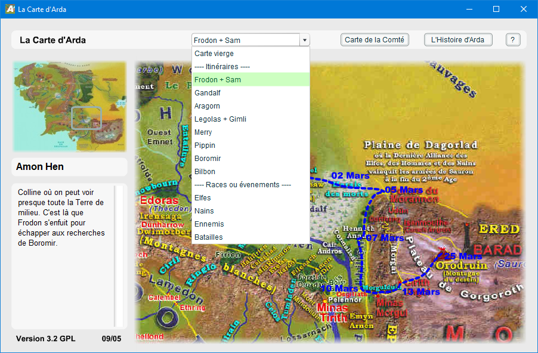

# La Carte d'Arda / Interactive Lord of the Rings Map

I wrote this small software in 2005 when I was 15/16 years old. This is a interactive Lord of the Rings Map:
* Navigation through the map
* Clicking on location to get information
* Displaying the itinerary of the characters

Since I did that as a teenager, everything is in French.
The software is written in Flash MX 2004/ActionScript 2.0 (it was in 2005...).
Therefore, it is probably impossible to open and edit the software with modern tools.
The resolution of the images is very low as it was meant to be usable with a 56k modem!
So, this tool is completely useless but I just refound it in my archives...

    

Look at [carte.exe](carte.exe) to test the map.

## Author

**Thomas Guillod** - [GitHub Profile](https://github.com/otvam)

## License

This project is licensed under the **GPL v2 License**, see [LICENSE.md](LICENSE.md).
